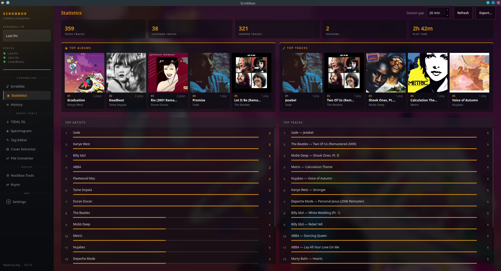
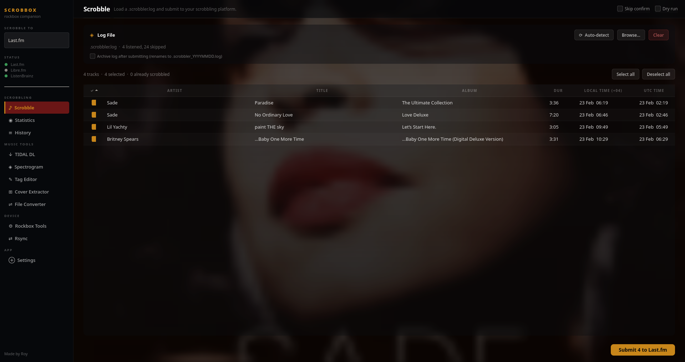
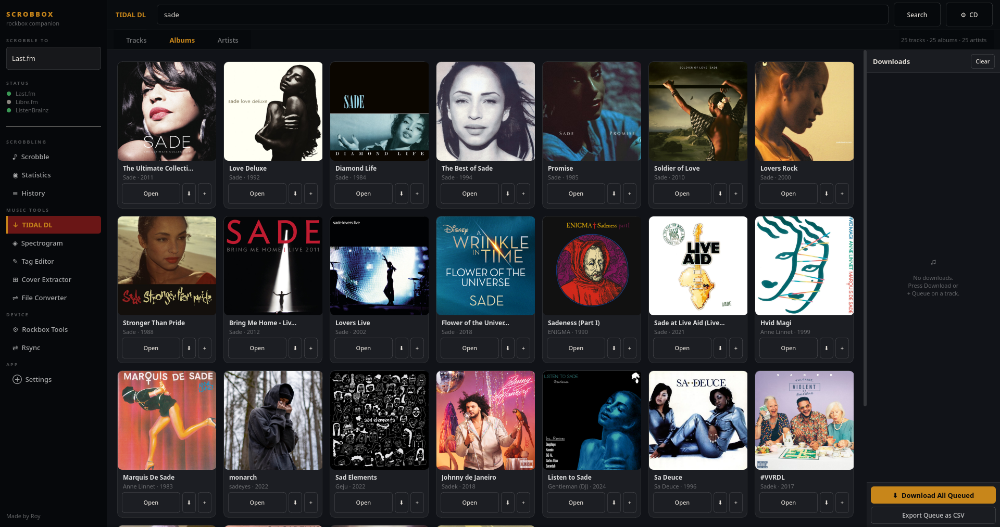
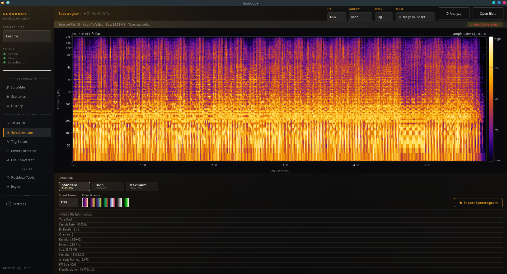
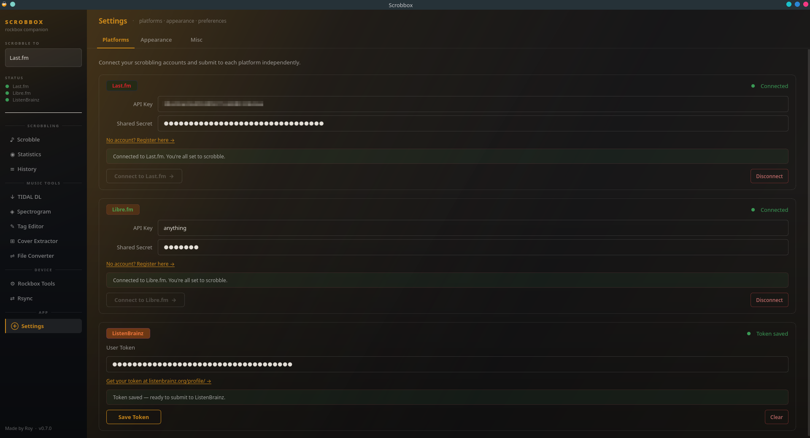
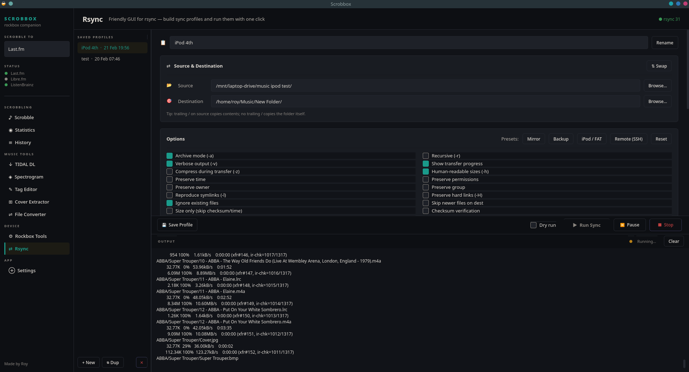
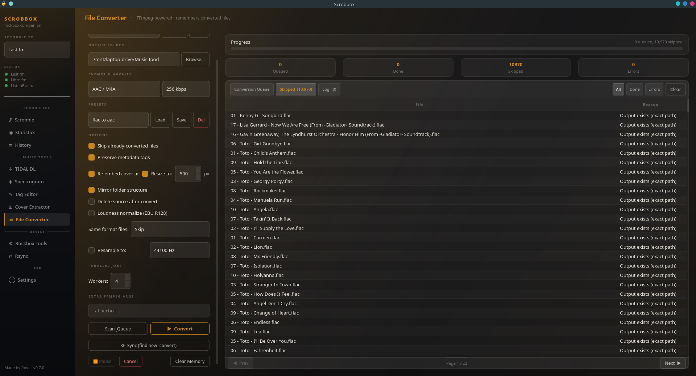
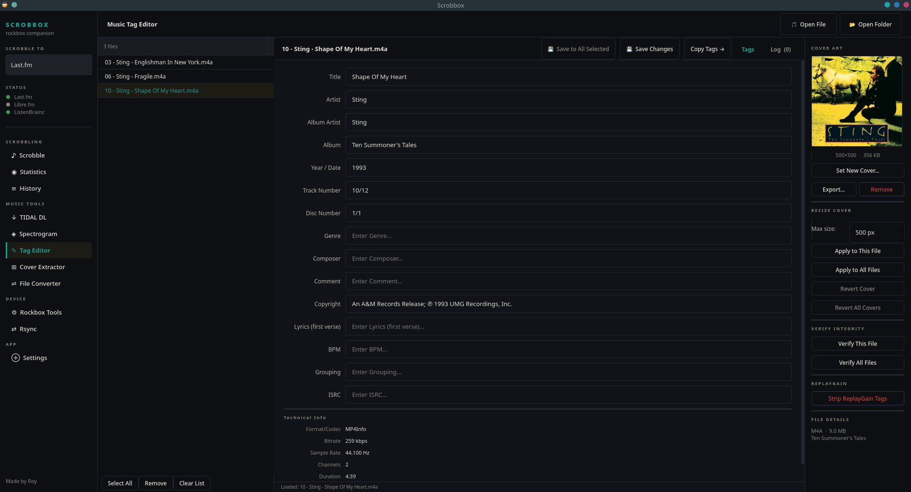
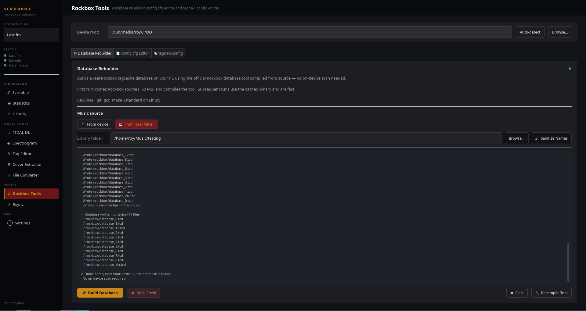
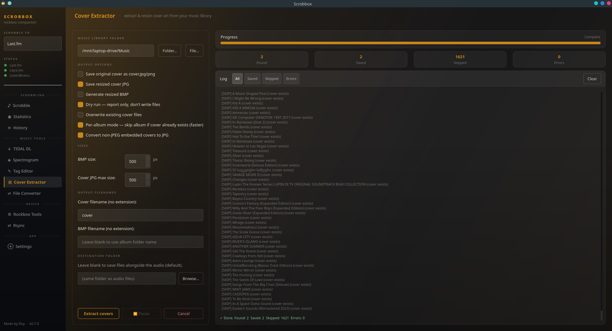

# Scrobbox

**By Roy**

**WARNING**
App is almost fully "vibe-coded", It is something to keep in mind, before using it.

A desktop companion app for Rockbox players and music libraries. Scrobbles your listening history, manages your Rockbox device, and handles your music collection — tag editing, file renaming, format conversion, cover art, spectrograms, and more.

---

## Screenshots

<p align="center">
  
  
</p>

<p align="center">
  
  
</p>

<p align="center">
  
  
</p>

<p align="center">
  
  
</p>

<p align="center">
  
  
</p>

---

## Download

Grab the AppImage from the [Releases](../../releases) page. No install required.

```bash
chmod +x Scrobbox-x86_64.AppImage
./Scrobbox-x86_64.AppImage
```

---

## What it does

### Scrobbling
Submit your Rockbox `.scrobbler.log` to **Last.fm**, **Libre.fm**, or **ListenBrainz**. Tracks already-submitted entries to avoid duplicates. Optional log archiving after submission. Dry run mode.
For Libre.fm put anything you want in api and shared secret sections and press "Connect to Libre.fm"

### Statistics
Local stats from your submission history — total tracks, play time, sessions, top artists, albums, and tracks with album art.

### Submission History
Full searchable, paginated log of everything you've submitted across all platforms, with timestamps.

### Tag Editor
Bulk tag editor for MP3, FLAC, M4A, AAC, OGG, Opus, WMA, WAV, and AIFF. Edit title, artist, album artist, album, year, track number, disc, genre, and comment. Cover art viewer with resize and revert. Bulk cover resize with bulk revert. Strip ReplayGain tags. Verify file integrity. File renaming from tag templates. Sort by filename, title, artist, album, or date.

### File Converter
FFmpeg-powered converter. Accepts MP3, FLAC, M4A, AAC, OGG, Opus, WMA, WAV, and AIFF as input. Output formats: FLAC, MP3, AAC/M4A, OGG Vorbis, Opus, WAV, and AIFF. Tracks already-converted files per preset so re-scans only queue new or changed files. Optional EBU R128 loudness normalization. Configurable bitrate and sample rate. Saveable presets.

### Album Cover Extractor
Scan a library folder and extract embedded cover art to folder images alongside each album. Optional BMP output sized for Rockbox displays.

### Spectrogram
Drag-and-drop audio file inspection. Visualizes frequency content so you can check whether a "lossless" file is genuine or an upsampled transcode.

### TIDAL Downloader
Search TIDAL by track, album, or artist and download. Quality falls back automatically from Hi-Res Lossless → CD Lossless → 320k depending on availability. Embeds full tags and cover art.

### Rockbox Tools
- **Database Rebuilder** — rebuild Rockbox tagcache `.tcd` files on your PC without booting into Rockbox. The AppImage includes a pre-compiled binary. When running from source, the tool is compiled automatically on first use by cloning the official Rockbox repository — requires `git`, `gcc`, and `make`.
- **config.cfg Editor** — editor for every Rockbox setting with descriptions and validation.
- **tagnavi.config Editor** — visual tree editor for Rockbox database navigation menus. Generates valid chained syntax.

### Rsync
GUI for rsync with saved profiles. Presets for mirror, backup, and SSH remote sync. Safe revert using timestamped backup dirs. Filename sanitizer to strip characters that cause issues on FAT32.

### Appearance
Accent color presets (Amber, Teal, Crimson, Violet, Cobalt, Sage, Rose, Slate, Sunset, Forest) with custom color picker and full per-color override. Font size control.

---

## Running from source

```bash
git clone https://github.com/RoyLikesAudio/Scrobbox.git
cd Scrobbox
pip install -r requirements.txt
python scrobbox.py
```

**System packages needed:**
- `ffmpeg` — file conversion, spectrogram, integrity check
- `rsync` — only if you use the Rsync page
- `git`, `gcc`, `make` — only if you use the Rockbox database rebuilder (compiles the tool from source on first run)
- `numpy` — faster spectrogram rendering

---

## Credits

Made by Roy.

### Third-party libraries
- **[Rockbox](https://www.rockbox.org)** — database tool compiled from source for tagcache rebuilding — GPL v2+
- **[hifi-api](https://github.com/binimum/hifi-api)** by sachin senal — TIDAL download functionality — MIT License
- **[rsync](https://github.com/rsyncproject/rsync)** — file sync engine used by the Rsync page — GPL v3
- **[mutagen](https://github.com/quodlibet/mutagen)** — audio tag reading and writing — GPL v2
- **[ffmpeg](https://ffmpeg.org)** — audio conversion, spectrogram rendering, integrity checking — LGPL v2.1+
- **[Pillow](https://python-pillow.org)** — image processing for cover art — HPND License
- **[numpy](https://numpy.org)** — spectrogram computation — BSD License

---

## License

MIT
